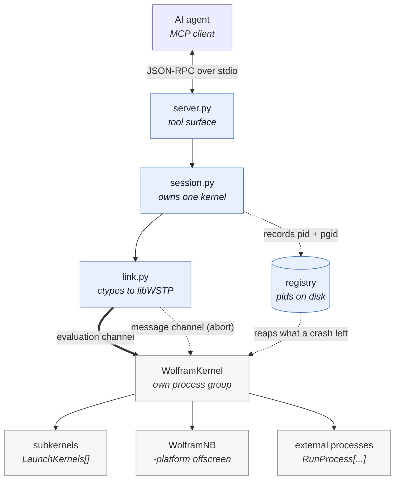
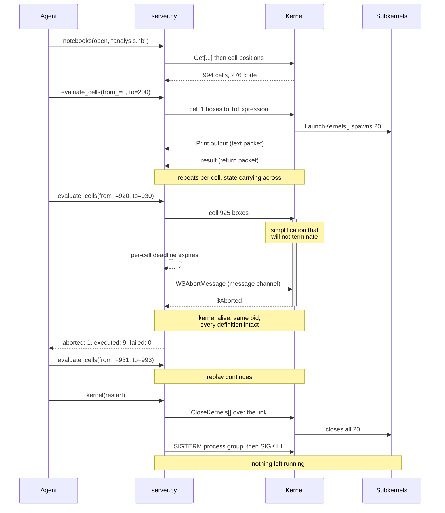

# Mathematica MCP over WSTP

**A Mathematica MCP server that can interrupt a running computation instead of abandoning it.**

Your AI agent can write Wolfram Language. This server runs it in a persistent
kernel and lets the agent stop work that has gone wrong, keep every definition,
and carry on. Notebooks on disk replay cell by cell. A headless front end
supplies typeset images with no display attached.

[](https://www.python.org/downloads/)
[](https://www.wolfram.com/mathematica/)
[](https://reference.wolfram.com/language/guide/WSTPAPI.html)

---

## Why this exists

A Mathematica session driven by an agent fails in ways an interactive session
does not. A simplification that will never finish looks exactly like one that
needs another minute. A kernel that has crashed looks exactly like a kernel that
is busy. A parallel job torn down carelessly leaves subkernels behind, several
hundred megabytes each, until the machine runs out of memory.

WSTP solves all three at the transport layer, because it carries an out-of-band
message channel alongside the evaluation.

**Abort without losing the session.** `abort()` interrupts the running
evaluation and returns `$Aborted`. The kernel keeps its process and everything
defined in it. This is the mechanism behind the front end's *Abort Evaluation*.

**A dead kernel is an error, not a hang.** The link reports a lost connection in
a fraction of a second, so a crashed kernel surfaces as a typed failure rather
than a call that never returns.

**Timeouts keep your work.** An evaluation that blows its deadline is aborted;
the kernel stays up. Variables from earlier calls are still defined, so you can
retry a smaller piece instead of rebuilding the session.

**Nothing is left running.** Each kernel gets its own process group and a
durable record on disk. Shutdown closes parallel subkernels first, then signals
the group. A server that is killed outright is cleaned up on the next start.

**Fast enough to ignore.** The round-trip floor is about 0.3 ms, so splitting
work across several calls costs nothing.

---

## What you can ask for

You ask in plain language. The agent chooses the tool and makes the call. Each
example below shows the request in bold and the call it turns into, so you can
see what the server is actually being asked to do.

**"Integrate that, and stop if it takes more than ten seconds."**

```text
evaluate("Integrate[Sqrt[1 + x^4], x]", timeout=10)
=> timed_out: true
   kernel_state: "intact, the evaluation was aborted rather than the kernel"
   next_step: "Retry with a smaller input. Earlier variables are still defined."
```

**"That has gone off the rails. Stop it."**

```text
abort()
=> confirmed: true
   "Evaluation interrupted; kernel state is intact."
```

**"Replay this notebook and tell me what broke."**

```text
notebooks(action="open", path="/path/to/analysis.nb")   => 994 cells, 276 code cells
evaluate_cells(from_=0, to=200)
=> counts: {executed: 51, skipped: 154, aborted: 0, failed: 0}
   messages: [{index: 88, name: "Part::partw", text: "Part 5 of {1, 2} does not exist."}]
```

**"Show me what cell 39 actually looks like."**

```text
render(action="cell", index=39)
=> [typeset PNG from a headless front end, no display required]
```

**"Check this derivation."**

```text
verify_derivation(steps=["(a+b)^3", "a^3 + 3 a^2 b + 3 a b^2 + b^3"])
=> all_verified: true
```

---

## Quick start

**Prerequisites:** Mathematica 14 or newer (15 recommended) and
[uv](https://docs.astral.sh/uv/). There is no compiler step and no Wolfram SDK
to build: the transport binds directly to the WSTP library your installation
already ships.

```bash
git clone https://github.com/sudeepan/mathematica-mcp-wstp.git
cd mathematica-mcp-wstp
uv venv --python 3.12 .venv
uv pip install --python .venv/bin/python -e .
```

Register it with your client:

```bash
claude mcp add --scope user mathematica-wstp -- "$PWD/.venv/bin/mathematica-wstp"
```

> `--scope user` matters. `claude mcp add` defaults to `--scope local`, which
> registers the server for one directory only. Every other session then reports
> it as unavailable, which looks like a connection failure but is not one.
> Verify from a different directory, `cd /tmp && claude mcp list`, because
> checking from the project directory hides the mistake.

Restart your client and ask for an integral.

The installation, kernel binary and WSTP library are located automatically,
including relocated installs reachable only through a symlink on `PATH`.
Override with `MATHEMATICA_WSTP_KERNEL`, `MATHEMATICA_WSTP_INSTALL` or
`MATHEMATICA_WSTP_LIB`.

---

## Tools

Fourteen consolidated tools rather than a wide flat surface, because a client
pays for every tool description in its context on every call.

| Tool | Purpose |
|------|---------|
| `evaluate` | Run Wolfram Language in the persistent kernel |
| `abort` | Interrupt the running evaluation, keeping all state |
| `kernel` | `state`, `restart`, `abort`, `subkernels`, `reap` |
| `status` | Kernel, installation and tracked-process health |
| `notebooks` | `open`, `create`, `list`, `info`, `save`, `close` |
| `cells` | List or read cells of an open notebook |
| `evaluate_cells` | Replay cells in document order, state carrying between them |
| `edit_cells` | Insert or delete a cell |
| `render` | Typeset an expression, rasterise a cell, or export a notebook |
| `vars` | Inspect, set or clear the kernel's `Global`` symbols |
| `batch` | Run several tools in one round trip |
| `verify_derivation` | Check a chain of expressions step by step |
| `read_notebook_file` | Read a `.nb` without opening a session |
| `guide` | Usage notes by topic |

### Notebooks are files, evaluated faithfully

A notebook here is a `.nb` on disk. Cells are evaluated from their original
stored boxes and located by position in the notebook expression. They are never
rebuilt, and never retyped from a rendered preview: retyping is a transcription
step whose failure mode is silent non-evaluation, and round-tripping through a
box-to-text converter is what corrupts `\[Gamma]` and its relatives.

Only `Input` and `Code` cells run. Prose and stored output are reported as
skipped and counted separately, so a replay's success figure means what it says.

### Messages and printed output are never dropped

`Print` output and every Wolfram message arrive alongside the result:

```json
{ "output": "{1, 2}[[5]]",
  "messages": [{"name": "Part::partw", "text": "Part 5 of {1, 2} does not exist."}] }
```

A plausible-looking answer with a message attached is usually the message's
fault. Discarding them is the worst failure mode available, because the answer
still looks fine.

### Rendering is headless

`render` drives the Wolfram front end with `-platform offscreen`: no display, no
X server, no configuration, about 1.8 s to start on demand. It returns real
image content, so typeset mathematics and graphics can be looked at rather than
read as box markup.

It renders and never evaluates. Evaluation belongs on the kernel link, where
abort and liveness both hold.

---

## How it works

Two paths carry information, and keeping them apart is the whole design.



The thick arrow into the kernel is the evaluation: one expression down, one
result back. The dotted arrow beside it is WSTP's out-of-band message channel,
which stays writable while the evaluation channel is blocked. Everything this
server does that a request/reply socket cannot comes from that second arrow.

### A real trace

Replaying a notebook in which one cell never terminates:



Three moments in that trace are the point of the project.

1. **The abort lands on a busy kernel.** The deadline fires in Python, the
   message goes out of band, and the evaluation returns `$Aborted`. The caller
   does not wait forever and the kernel is not destroyed.
2. **The replay carries on.** Cell 925 failing costs cell 925, not the session.
   Everything the first 924 cells defined is still in the kernel.
3. **Shutdown reaches the whole tree.** The kernel is asked to close its
   subkernels over the link while it can still answer. Only then is the process
   group signalled, so nothing is left to be found later.

---

## Who this is for

| Audience | Use case |
|----------|----------|
| Researchers running long symbolic computations | Interrupt a runaway simplification without losing an hour of setup |
| Anyone replaying large notebooks | Cell-by-cell execution with per-cell timeouts and honest counts |
| Headless and remote hosts | Full typeset rendering with no display attached |
| Long-lived agent sessions | Parallel subkernels tracked and reclaimed rather than leaked |
| **Not for** | Untrusted input or multi-tenant hosts. An evaluation is arbitrary code execution. |

---

## Requirements

- Mathematica 14 or newer, with the WSTP library that ships with it
- Python 3.10+
- Linux or macOS. Windows is untested.
- One third-party Python dependency: `mcp`

---

## Measured on

Mathematica 15.0.1, Linux-x86-64, warm kernel.

| | |
|---|---|
| Round-trip floor (`1+1`) | 0.27 ms |
| Symbolic result (`Integrate[1/(1+x^3),x]`) | 2.1 ms |
| 100 KB result | 10.9 ms |
| Abort to `$Aborted`, same kernel pid, state intact | 2.0 s |
| Dead kernel reported as a typed error | 0.3 s |
| Headless front end, cold start | 1.8 s |
| Kernel shutdown with its subkernel tree closed | 0.27 s |

## Tests

```bash
python3 tests/test_kernel.py                # transport and supervision, no dependencies
.venv/bin/python tests/test_server_mcp.py   # end to end over MCP stdio
```

Point `MATHEMATICA_WSTP_TEST_NOTEBOOK` at any `.nb` to exercise the notebook
tools against a real document. Those checks are skipped when it is unset.
