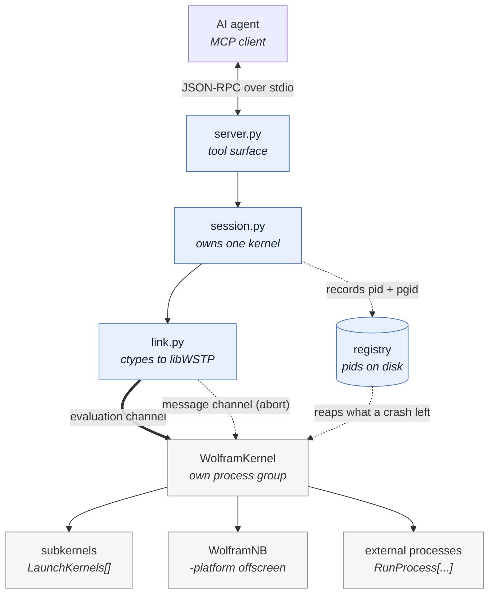
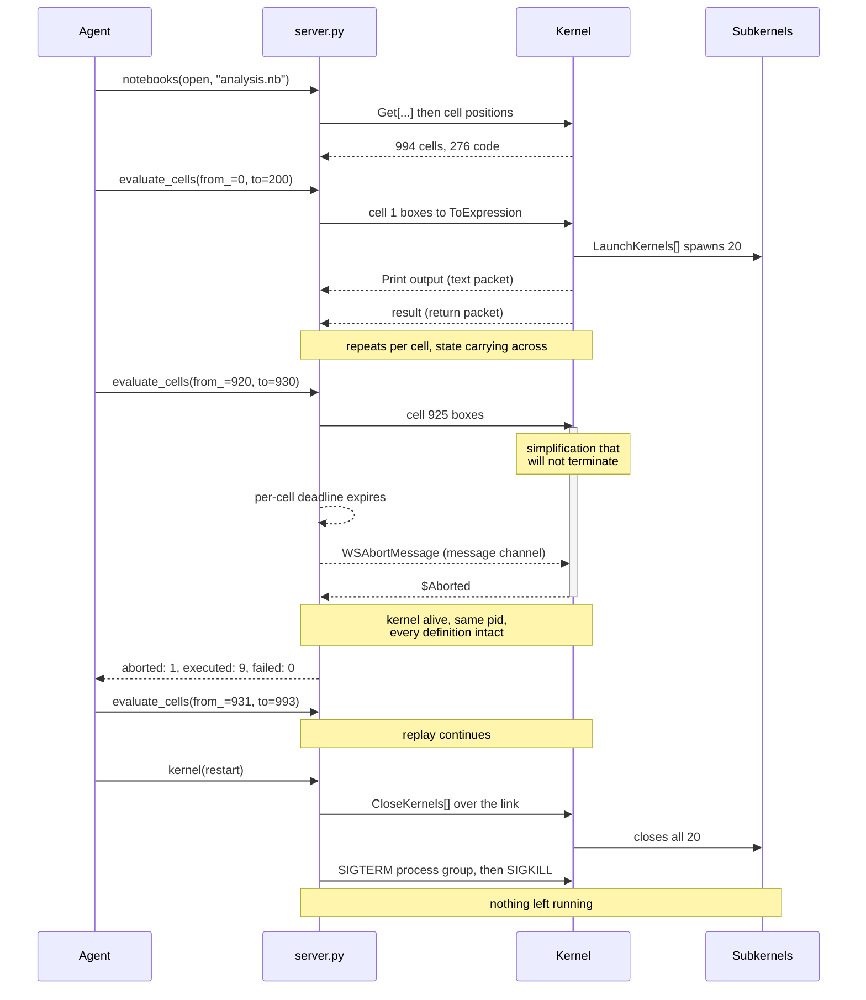
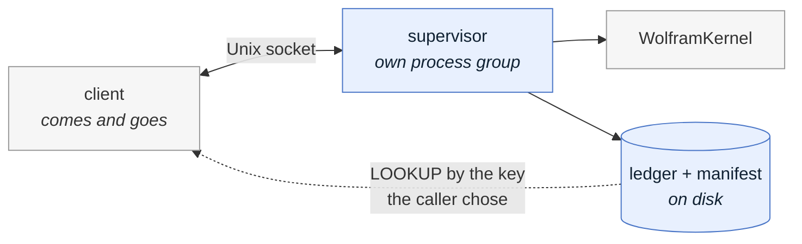

# How it works

Two paths carry information between the server and the kernel, and keeping them
apart is the whole design. Everything this server can do that an ordinary
request/reply socket cannot comes from the second one.

## The two channels

The thick arrow into the kernel is the evaluation: one expression down, one
result back. The dotted arrow beside it is WSTP's out-of-band message channel,
which stays writable while the evaluation channel is blocked. Everything this
server does that a request/reply socket cannot comes from that second arrow.

## A real trace

Replaying a notebook in which one cell never terminates:

Three moments in that trace are the point of the project.

1. **The abort lands on a busy kernel.** The deadline fires in Python, the
   message goes out of band, and the evaluation returns `$Aborted`. The caller
   does not wait forever and the kernel is not destroyed.
2. **The replay carries on.** Cell 925 failing costs cell 925, not the session.
   Everything the first 924 cells defined is still in the kernel.
3. **Shutdown reaches the whole tree.** The kernel is asked to close its
   subkernels over the link while it can still answer. Only then is the process
   group signalled, so nothing is left to be found later.

---

## Where the supervisor fits

Everything above describes the default arrangement, where this server owns the
kernel. That makes kernel lifetime equal to client lifetime: measured, a kernel
exits about a second after its owner is killed. For a cell that runs for
minutes that is a nuisance; for one that runs for days a dropped connection
destroys the work.

The supervisor is the other arrangement. A separate process owns the kernel and
takes requests over a Unix socket, so a client can come and go while the
science continues.

It is opt-in and never starts by itself. See
[`long-running-work.md`](long-running-work.md).
