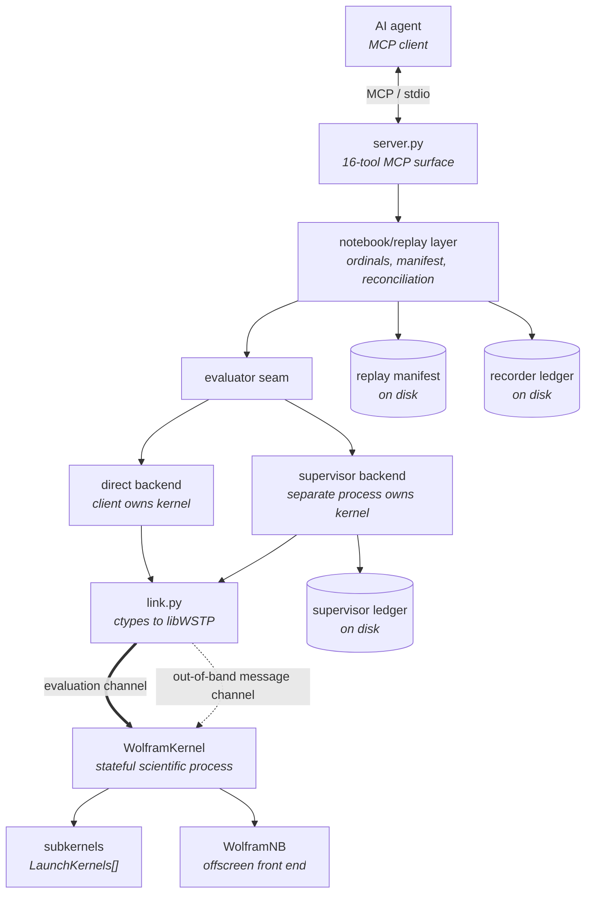
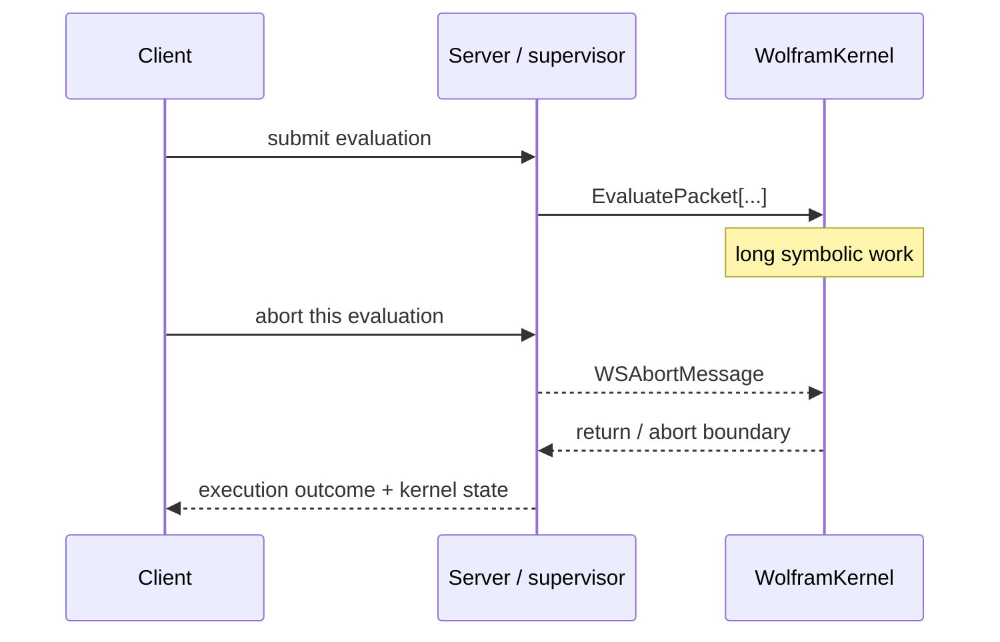
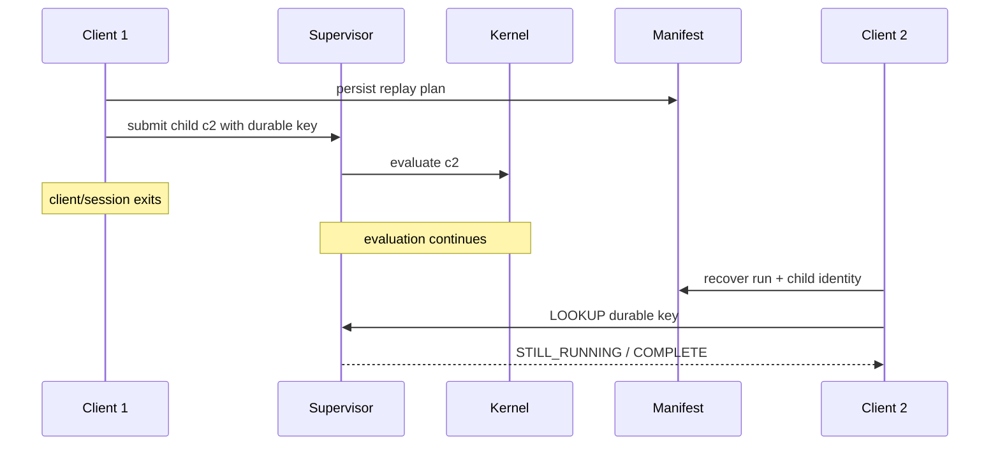

# How it works

This project is easiest to understand as an **execution record around a stateful
symbolic kernel**, not as a thin RPC wrapper around Mathematica.

An agent can ask for an expression to be evaluated. The server also has to
answer harder questions later:

- Which exact notebook cell was that?
- Was the evaluation ever submitted?
- Is it still running after the client disappeared?
- Did an abort come from the caller or from the Wolfram code?
- Does the output currently in the notebook belong to that execution?
- Did the notebook source change after the replay was planned?

The architecture separates those questions so that one component does not have
to pretend it knows facts owned by another.

## The layers



The **notebook/replay layer** knows notebook semantics: executable-cell ordinal,
source identity, output provenance and replay progress.

The **supervisor** knows execution facts: what request was accepted, which
evaluation is active, what control was requested, and whether the kernel is
healthy enough to reuse.

The **WSTP link** knows transport facts: whether an evaluation packet has been
sent, whether a return packet arrived, whether the link died, and how to send an
out-of-band abort.

Keeping those vocabularies separate is deliberate.

## Why two WSTP channels matter

The evaluation channel is one expression down and one result back. While that
channel is blocked on a long symbolic computation, WSTP's message channel is
still available.

That second path is what makes targeted control possible:



The important claim is not simply "abort works." It is that control traffic can
be observed separately from the scientific result.

## Notebook identity: ordinal, not index

A raw notebook index is unstable. Writing one output inserts a cell and shifts
the index of everything after it.

A replay therefore addresses executable cells by **ordinal**:

> the nth `Input` or `Code` cell, counting only executable cells.

The seventh input remains the seventh input even if six new output cells have
been inserted before it.

`replay` assigns each executable child its own identity and writes the intended
run to a sidecar manifest before the first child is submitted. That manifest is
owned by the notebook layer, because the supervisor should not need to
understand notebook ordinals or cell-source digests.

## Four records, four questions

A reconnecting client may need information from four places:

```text
replay manifest
    What did this run intend to do?

supervisor ledger
    What execution was actually accepted, and what became of it?

recorder ledger
    What source was written, what disposition did each cell get,
    and was the notebook verified before and after?

current notebook session / file
    What source and output are present now?
```

None is a substitute for the others.

For example, an output present in the live notebook is not by itself proof that
this replay produced it. Output provenance binds it back to the replay child
that wrote it. Likewise, a supervisor request fingerprint proves the identity of
the request it received; notebook source identity is checked by the notebook
layer.

## Reconciliation after interruption

For a supervised replay, client death does not imply computation death.



The old MCP call that was waiting is gone. The **scientific computation** and
its execution identity can remain.

`STILL_RUNNING` is therefore a normal reconciliation state, not a failure.

## Direct versus supervised ownership

The evaluator seam supports two ownership arrangements.

### Direct backend

```text
MCP process
└── WolframKernel
```

Simple and fast. If the owning process dies, the kernel dies shortly afterward.

### Supervisor backend

```text
MCP client/process       (may disappear)
        │
        ▼
supervisor process       (owns execution and ledger)
        │
        ▼
WolframKernel
```

The supervisor is opt-in. Nothing starts it implicitly.

It is for work whose lifetime should not equal the lifetime of one MCP client
session. It protects against **client loss**. It does not make an in-progress
kernel evaluation survive kernel failure or host failure.

See [`long-running-work.md`](long-running-work.md).

## A real notebook trace

A typical auditable replay looks like this:

```text
1. choose direct or supervisor backend
2. open notebook in that backend's kernel
3. create replay run and persist manifest
4. submit executable ordinal 1
5. record request / execution identity
6. evaluate stored boxes in the persistent kernel
7. bind any written output to that replay child
8. advance to the next ordinal
9. if interrupted, reconcile instead of guessing
10. save the notebook explicitly when file durability is required
```

The last step matters. A notebook opened by the server is a live document in the
kernel. Output write-back first changes that session-resident document; it is not
a saved `.nb` file until `notebooks(action="save", ...)` succeeds.

## Process tree and front end

The master kernel may own:

- parallel subkernels created by `LaunchKernels[]`;
- an offscreen `WolframNB` front end used for rendering/saving;
- managed external processes.

Subkernels are tracked and can be closed without discarding the master kernel's
scientific state. Rendering is deliberately separate from evaluation: the front
end typesets; the kernel link computes.

## The design rule

The project repeatedly encountered the same class of failure:

```text
component says "done"
≠
external evidence proves the intended thing happened
```

A status flag cannot prove an artifact exists. A replay summary cannot prove
the notebook structure is correct. A client cannot infer that an orphaned
evaluation stopped merely because the waiting RPC disappeared.

The architecture therefore tries to make each important claim checkable at a
boundary owned by a different component.

That is the reason for the manifest, ledger, output binding, link liveness,
process census and notebook verification. They are not independent features;
they are different applications of the same rule.
